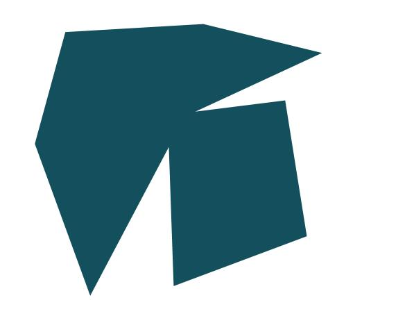
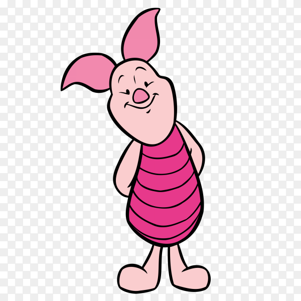
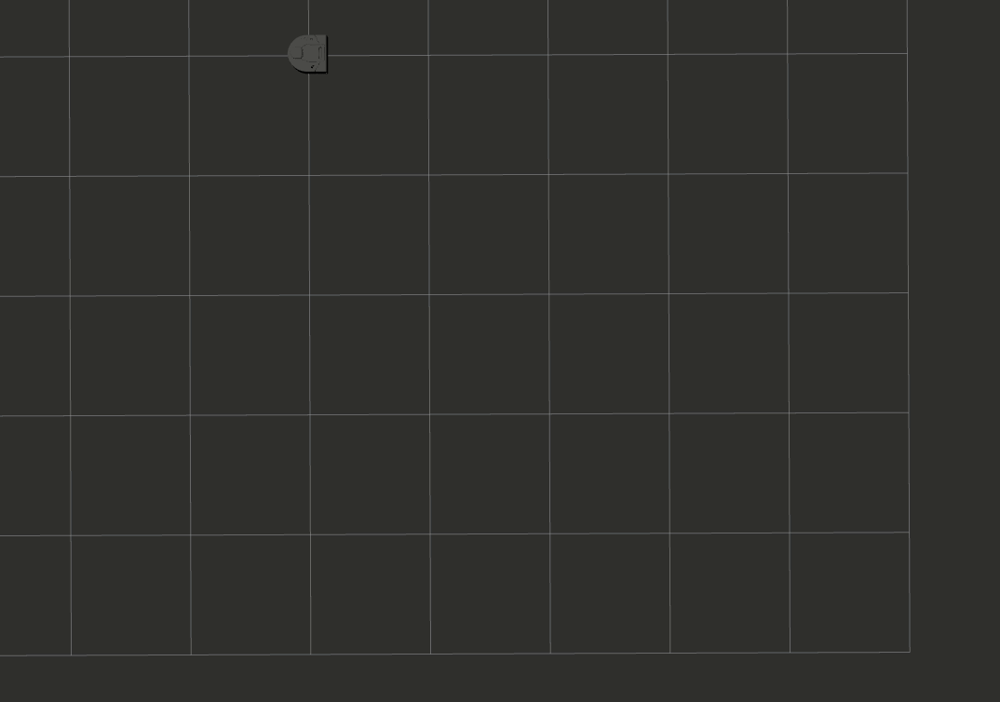
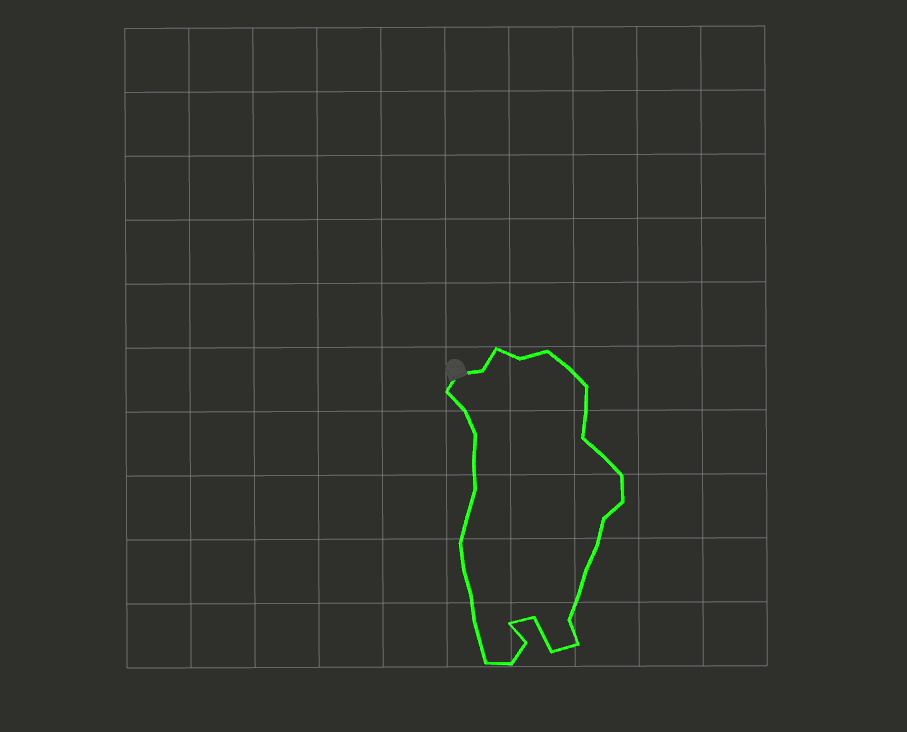
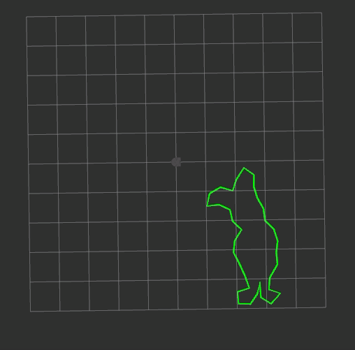

# Computer Vision
Anna Griffin, Sherrie Shen  
November 11, 2020

## Introduction
Computer vision and its applications in the field of robotics is quite extensive. It is not uncommon to find a camera or many on a robot these days. The camera is its lense into the world we experience as they beginning getting more stophicated at processing the visual data. There are many algorithms that are leveraged to address a variety of challenges that come along with computer vision. We chose to look into image processing, specifically contour detection algorithms.

The goal of our project was to be able to extract a path that a robot could follow based on an image. Using a contour algorithm that we implemented ourselves, first extract a set of points that make up the contour of a given image. Then, we filter them into waypoints that serve as instructions the robot is able to interpret. Finally, we publish this series of points to the robot so that it can follow accordingly.

## Contour Detection
Contour detection is an integral part of image processing. Contours are defined by a continuous curve around an object of the same color/intensity. Facial recognition as well as object and shape detection have foundations rooted in contour detection. Typically threshing and/or edge detection is applied to the image and converted to binary. This makes it easy to distinguish between pixels that make up the object and ones that are part of the background. Due to the stark difference between white pixels and black pixels, we are able to more easily identify the points at which the object and the background meet which is what we are interested in for the contour. While scanning the image, we can keep track of these changes in pixel color to identify an estimate of the perimeter of the shape embedded in our image.  

## Video Demonstrations

<table>
    <thead>
      <tr>
        <th>Fish</th>
        <th>Winnie the Pooh</th>
        <th>Piglet</th>
      </tr>
      <tr>
        <td></th>
        <td></th>
         <td></th>
      </tr>
      <tr>
        <td></th>
        <td></th>
         <td></th>
      </tr>
    </thead>
  </table>

## Implementation

### Contour Detection Algorithm

#### Extracting Contour Points
Given an image that we convert to binary, it is pretty easy to distinguish between object pixels (white) and background pixels (black). We can then scan this image, right to left, up to down and mark the transitions from black to white or white to black. Starting on the right and scanning towards the left, there are three scenarios that can occur. 1) The entire row is made up of background pixes and therefore we do not save any of these points as potential contour pixels. 2) A black (background) transitions to a white (object) pixel. When this sequence occurs, we can deduce that it is a right edge contour point. We mark this point as a contour point along with an indicator of which side it belongs to (more on that in sections below). 3) On the other hand, when a white pixel proceeds a black pixel, we know that we have found another contour point, this time on the left side.

The entire image gets scanned in this way to ensure that all of the pixels on the outer bounds of the object are identified. In our implementation, we created a `ContourPoint()` class which we store the x and y values of a point of interest along with two other important pieces of information about the point. The first, denoted by N, holds the number of contour points in the adjacent row. Depending on whether the point is a left contour point or a right point, the sigh of `N` is also significant. Since we are drawing a contour in a counter clock direction, left contour points will receive a positive value because their neighboring scan line will be below it, and thus will have a greater y value. The right contour points will always be negative. When a right contour point is reached going counter clockwise, the next scan line will be a row above the current, therefore reducing the vertical index. 

The second value contains information about the horizontal movement between the target pixel and the following one. To make sense of the image in this context, each pixel can be looked in comparison to its eight neighbors. Depending on the coloring of the pixels around the target one, we can determine if the boundary of the shape shifts along the x direction between those two points. There are four different scenarios that can occur near a point along with the possibility that there is no horizontal movement at all (this would look like a vertical line). Two of them are right contour point specific and the other two only occur with left contour points. This is an opportunity for efficiency as it reduces the amount cases that we have to check at this step. If the direction in the horizontal direction is positive, the `H` value of that point will be positive, and negative when the horizontal direction is negative. If no horizontal direction is identified, the value gets set to 0 which will become important in the reordering step.

#### Reordering Contour Points
All of the contour points are stored in table when the `StorageTable()` class is initialized. The storage class contains many functions that help re arrange all of the contour points so that they are in order if you were to plot and trace them. Before this step, the contour points are still ordered how we scanned them which was right to left, top to bottom. To start, we chose an index to start with. This point doesn't really matter since the contour will be a closed loop in the end. This first point can be added to the list of ordered contour points. Next, we want to look at the N value the the current point. Since the N value is signed, we know which direction in the table we should begin our search. There will always be an even number of points in a given row in our case so the indices of the potential neighbors will only be even values. We can assume that we are skipping over the right contour point or points that may also be in the neighboring row. Since it is possible that there could be multiple contour points in one row, we want to look at all of the points between `i + P.N` and `i + m` with m being the total of neighbors in the adjacent row and both points on either side of i (`i+1` and `i-1`). In the cases where there are multiple neighbors, the one that is closes to the current point is chosen.

These steps are repeated until you have come full circle. The points as they are visited are added to the list of ordered contour points. 

#### Design Decisions for Implementation

### Contour to Waypoints

#### Design Decisions for Implementation

### Robot Instructions

#### Design Decisions for Implementation

## Other Design Decisions

### Random Noise When Updating Odom

### Particle Cloud Initialization Radius

### Sorting Particles for Updating Robot Pose

### Updating Particles

## Challenges and Improvements

### Identify Holes
An extension of this project could include modifying the algorithm to be able to handle holes and multiple contour lines. Currently, there is no way to determine if there are two separate contours since we only look at three lines at most at any given time. Also, there is no way to indicate how the robot is supposed to travel from one to the other if there multiple did occur. This would be a very useful addition to this implementation of the algorithm since it would greatly increase the variety and complexity of images the robot can handle. 

### Develop Image Testing Methods
To test parts of the algorithm, we used a very small 10 by 6 grid as mock image input data. It was very helpful to have a small scale sample to work with while implementing the algorithm, however the jump to actual images was quite large making it difficult to debug. The images that we used had hundreds of rows and columns making it impossible to look at all of the raw data at once. Throughout development, we hacked together small plotting and print formatting functionalities to help us visualize the information and debug. This could have been done in a more methodical way which would have kept for work flow more organized and clear. It is difficult to get a good grasp of which methods and ways of testing will be most effective at the beginning of development, nonetheless establishing more tools to help us debug larger sets of data would have been helpful as soon as we had gotten the mini version working as we had expected.  

## Takeaways
Since this project had significantly less scaffolding that the previous ones, it was very apparent to us that the more planning that occurs ahead of time, the better of you'll be along the rest of the way (and maybe save yourself from a few grey hairs). Having the freedom to choose our focus for the project made it particularly exciting since we were able to use what we have learned thus far in the course to discover a particular area of computer vision and robotics. Due to the privilege
 of being able to outline our own project, there was a considerable amount of additional design work that had to be thought through at the beginning of the project. While this is a realistic tradeoff, this was a new experience for both of us compared to the previous projects which took a little bit of adjusting. Looking back, planning earlier rather than later seems like a valuable lesson that we can take away from this project. 